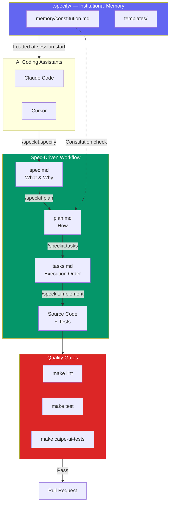

## The Problem: AI Assistants Without Context

AI coding assistants like [Claude Code](https://docs.anthropic.com/en/docs/claude-code) and [Cursor](https://cursor.sh) are powerful — but they work best when they understand the **intent** behind your project, not just the code. Without guardrails, they tend to:

- Generate code that drifts from the original design
- Make inconsistent architectural choices across sessions
- Skip quality gates that your team requires
- Over-engineer solutions or add unrequested features

What if there was a way to give AI assistants a **constitution**, a **specification workflow**, and **institutional memory** — so every session starts with shared context?

That's exactly what [spec-kit](https://github.com/github/spec-kit) does.

## What Is Spec-Kit?

**Spec-kit** is a [Spec-Driven Development](https://github.com/github/spec-kit/blob/main/spec-driven.md) (SDD) framework from GitHub. It provides a structured workflow where **specifications are the source of truth** and code is the output.

At its core, spec-kit gives you:

1. **A `.specify/` directory** — the institutional memory of your project
2. **A constitution** — governing principles that all agents and engineers must follow
3. **Templates** — for specs, plans, tasks, and checklists
4. **Slash commands** — that work in both Claude Code and Cursor

The key insight is that AI assistants are **first-class contributors**. The `.specify/` directory is designed to be read by both humans and AI agents at the start of every session.

## The Spec-Driven Workflow

Spec-kit defines a four-phase pipeline that takes you from idea to production code:


```text
/speckit.specify <description>   → spec.md    (what and why)
/speckit.plan <tech choices>     → plan.md    (how)
/speckit.tasks                   → tasks.md   (execution order)
/speckit.implement               → source code + tests
```

### Phase 1: Specify

You describe a feature in natural language. The `/speckit.specify` command generates a `spec.md` that focuses on **what** users need and **why** — no implementation details.

```markdown
## User Stories
- As a platform engineer, I want to query incident status
  so that I can triage without switching tools.

## Acceptance Criteria
- [ ] Incidents are retrievable by ID
- [ ] Response includes severity, status, and assignee
- [ ] Query completes in under 2 seconds
```

The command automatically:
- Creates a numbered feature branch (e.g., `001-feature-name`)
- Generates a spec from your description
- Runs a quality validation checklist (completeness, clarity, measurability)
- Limits ambiguity markers to at most 3 critical questions

### Phase 2: Plan

`/speckit.plan` translates the spec into a technical implementation plan. It:

- Checks the plan against the **constitution** (more on this below)
- Generates `research.md` to resolve unknowns
- Produces `data-model.md` and API contracts
- Updates agent context files so the AI remembers tech choices

### Phase 3: Tasks

`/speckit.tasks` breaks the plan into a dependency-ordered, parallelizable task list:

```markdown
- [ ] T001 Create project structure per implementation plan
- [ ] T005 [P] Implement auth middleware in src/middleware/auth.py
- [ ] T012 [P] [US1] Create User model in src/models/user.py
- [ ] T014 [US1] Implement UserService in src/services/user_service.py
```

Tasks marked `[P]` can run in parallel. Tasks tagged `[US1]`, `[US2]` map back to user stories. The format is strict — every task has an ID, a description, and a file path.

### Phase 4: Implement

`/speckit.implement` executes tasks phase by phase, following the [Red-Green-Refactor](https://martinfowler.com/bliki/TestDrivenDevelopment.html) cycle — write a failing test first (red), implement just enough to pass it (green), then clean up (refactor). It respects task dependencies and marks tasks complete as it goes.

## The Constitution: Governing Principles for Agents

The most powerful concept in spec-kit is the **constitution**. It lives at `.specify/memory/constitution.md` and defines non-negotiable principles that every AI agent session must follow.

Here's a real example from the [CAIPE project](https://github.com/cnoe-io/ai-platform-engineering):

```markdown
### I. Specifications as the Source of Truth
All development begins with a specification. Code serves the
specification — not the other way around.

### VII. Test-First Quality Gates (NON-NEGOTIABLE)
No production code ships without passing its defined quality gates.
Tests are derived from specifications, not written after implementation.

### X. Simplicity and Avoiding Over-Engineering
Implement exactly what the specification requires — no more.
YAGNI applies to both engineers and agents.
```

The constitution also defines:
- **Branching conventions** (`prebuild/<type>/<description>`)
- **Commit style** (Conventional Commits + DCO sign-off)
- **Bug handling tiers** (spec violation vs. spec gap vs. design flaw)
When `/speckit.plan` runs, it performs a **constitution check** — verifying that the implementation plan doesn't violate any governing principles.

### Bug Handling Tiers

The constitution classifies bugs by their relationship to specifications:

- **Tier 1 — Spec Violation**: A spec covers the behavior but the code doesn't match it. Fix the code.
- **Tier 2 — Spec Gap**: The bug is an edge case no spec addresses. Update the spec, then fix the code.
- **Tier 3 — Design Flaw**: No spec covers it and it's not just an edge case. Start fresh with `/speckit.specify`.

## Directory Structure

Here's what `.specify/` looks like in practice:

```text
.specify/
├── memory/
│   └── constitution.md        # Governing principles
├── templates/
│   ├── agent-file-template.md
│   ├── constitution-template.md
│   ├── spec-template.md
│   ├── plan-template.md
│   ├── tasks-template.md
│   └── checklist-template.md
└── scripts/
    └── bash/                  # Automation scripts
        ├── check-prerequisites.sh
        ├── create-new-feature.sh
        └── setup-plan.sh
```

The `specify init` CLI also installs slash commands directly into your agent's command directory (e.g., `.cursor/commands/speckit.*.md` or `.claude/commands/speckit.*.md`).

## How It Works with Claude Code and Cursor

When you run `specify init --ai cursor-agent` (or `--ai claude`), the CLI installs slash commands directly into the agent's command directory. Both tools get the same commands from the same spec-kit release.

### Cursor

Cursor reads commands from `.cursor/commands/`. When you type `/speckit.specify add user authentication`, Cursor loads the `speckit.specify.md` command file and follows its structured workflow — creating branches, generating specs, running validation.

### Claude Code

Claude Code reads commands from `.claude/commands/`. The same spec-kit commands are available as slash commands. Claude Code also reads `CLAUDE.md` at the repo root, which typically references the constitution and quality gates.

A typical `CLAUDE.md` ties everything together:

```yaml
# CLAUDE.md (repo root)

## Git Workflow
- Branch naming: `prebuild/<type>/<description>`
- Conventional Commits + DCO required on every commit
- DCO: `Signed-off-by: Your Name <your@email.com>`
- Always create PRs with `gh pr create`

## Quality Gates
- `make lint`           # Ruff linting (Python)
- `make test`           # All tests
- `make caipe-ui-tests` # UI Jest tests
```

### Both Get the Same Context

Because both tools receive their commands from the **same spec-kit release** via `specify init`, both follow identical workflows. The constitution, templates, and scripts are shared. This means:

- Switching between Claude Code and Cursor mid-project is seamless
- Both agents produce specs in the same format
- Quality gates are enforced consistently
- The institutional memory in `.specify/` is always the single source of truth

## Additional Commands

Beyond the core four-phase workflow, spec-kit includes:

| Command | Purpose |
|---------|---------|
| `/speckit.constitution` | Create or amend the project constitution |
| `/speckit.clarify` | Ask up to 5 targeted questions to reduce spec ambiguity |
| `/speckit.checklist` | Generate "unit tests for requirements" — validate spec quality |
| `/speckit.analyze` | Non-destructive cross-artifact consistency analysis |
| `/speckit.taskstoissues` | Convert tasks.md into GitHub Issues with dependencies |

The `/speckit.checklist` command is particularly interesting — it treats your **requirements as code** and generates checklist items that test whether the requirements themselves are complete, clear, and measurable:

```markdown
- [ ] CHK001 Are error handling requirements defined for all API
      failure modes? [Completeness]
- [ ] CHK002 Is 'fast loading' quantified with specific timing
      thresholds? [Clarity, Spec §NFR-2]
- [ ] CHK003 Are hover state requirements consistent across all
      interactive elements? [Consistency]
```

## What Generated Code Looks Like

When `/speckit.implement` runs, it produces code that traces back to the spec. Notice how the docstring references acceptance criteria from the spec, and each test maps directly to one:

```python
# src/incidents.py — generated from spec.md

def get_incident(incident_id: str) -> dict:
    """Fetch an incident by ID.

    Spec acceptance criteria:
    - AC-1: Incidents are retrievable by ID
    - AC-2: Response includes severity, status, assignee
    """
    response = client.get(f"/incidents/{incident_id}")
    response.raise_for_status()
    return response.json()
```

```python
# tests/test_incidents.py

def test_fetch_incident_by_id():
    """AC-1: Incidents are retrievable by ID."""
    result = get_incident("P12345")
    assert result["id"] == "P12345"

def test_incident_response_fields():
    """AC-2: Response includes severity, status, and assignee."""
    result = get_incident("P12345")
    for field in ("severity", "status", "assignee"):
        assert field in result
```

> Every test traces back to an acceptance criterion in the spec. If the spec changes, the tests change first.
{: .prompt-tip }

## Getting Started

To adopt spec-kit in your own project:

1. **Install the Specify CLI** and initialize your project:

   ```bash
   uv tool install specify-cli --from git+https://github.com/github/spec-kit.git
   specify init --here --ai cursor-agent   # or --ai claude
   ```

2. **Create the constitution** with `/speckit.constitution` — define what's non-negotiable: testing requirements, commit conventions, security constraints.

3. **Start your first feature**:

   ```bash
   /speckit.specify add user authentication with OAuth2
   /speckit.plan using Python, FastAPI, and PostgreSQL
   /speckit.tasks
   /speckit.implement
   ```

## The Full Picture

Here's how all the pieces fit together — from the `.specify/` institutional memory through to deployed code:



## Conclusion

As AI coding assistants become central to engineering workflows, the bottleneck shifts from **writing code** to **maintaining intent**. OpenAI's [harness engineering](https://openai.com/index/harness-engineering/) experiment demonstrated this vividly — a team shipped a million lines of fully agent-generated code by investing not in writing code, but in designing environments, specifying intent, and building feedback loops. Their key insight mirrors what spec-kit encodes: *humans steer, agents execute*.

This is the direction most engineering projects are heading. As teams push toward higher levels of agent autonomy — where agents own execution end-to-end and humans focus on architecture, specifications, and quality systems — the scaffolding around the AI becomes more important than the code it produces.

Spec-kit addresses this shift by:

- Making specifications the durable artifact (code is regenerable)
- Giving AI agents a constitution to follow across sessions
- Standardizing the workflow so it works with any AI tool
- Providing quality gates that catch drift before it ships

The spec is the spec. The code is just one possible output. The teams that invest in this scaffolding now — constitutions, spec workflows, institutional memory — will be the ones best positioned as agents take on increasingly autonomous roles in the software lifecycle.

---

*For more on spec-kit, see the [GitHub repo](https://github.com/github/spec-kit) and the [spec-driven development methodology](https://github.com/github/spec-kit/blob/main/spec-driven.md). For the CAIPE project that uses this approach, see [cnoe-io/ai-platform-engineering](https://github.com/cnoe-io/ai-platform-engineering).*
