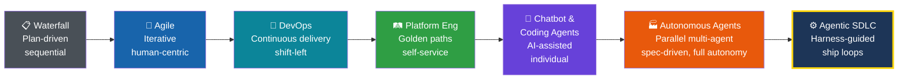
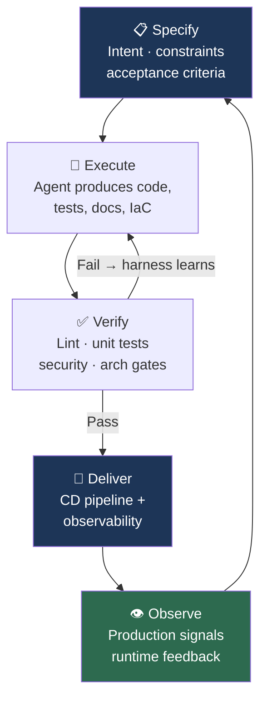

## The Discipline That Prepared Us for This Moment

Back in grad school, Software Engineering was one of my favorite courses. It is now taught as a complete graduate program at my [alma mater](https://academics.utdallas.edu/fact-sheets/ecs/ms-software-engineering/), and for good reason. That course and my professional experience taught me the difference between coding for fun and a rigorous, process-driven approach to releasing complex software. Think of a manufacturing plant or an assembly line: inputs are defined, quality is measured at every stage, and the final product ships because the *system* works like a clockwork. A well-oiled software engineering organization runs like clockwork: release managers and program managers deciding what goes into a release and what gets cut, bugs ruthlessly scrubbed daily as release dates approach and quality gates rigorously automated and vetted. I have seen my share of that clockwork in large production systems, and I have never stopped appreciating it.

Software Engineering, as the name suggests, is the **engineering optimization** of software: process-driven, disciplined, systematic. And here is what excites me most about the agentic era: the principles that make software engineering a discipline (requirements, specification (acceptance criteria), verification (testing), quality gates, feedback loops, security and supply chain integrity) are not threatened by AI agents writing code. They are **more important than ever**. The question is how we evolve that discipline to match the extraordinary speed at which agentic coding is reshaping the SDLC.

That is the conversation I want to have in this post. Not vibe coding. Not weekend prototypes. Those tools will provide a solid start for rapid prototyping and quick proof-of-concepts. But for any company where software is the product, where longevity matters, where teams need to collaborate and maintain what they ship: **how do we make agentic software development secure, sustainable, team-based, and enterprise-grade?**

At a recent meetup with software engineering leaders, the energy around this question was palpable. There is consensus that SDLC loops driven by agentic AI will become commonplace in the near future, and the smartest leaders in the room were already asking the right follow-up: *How do we put business problems ahead of coding speed? How do we organize teams around this? Where does more code actually create more value, and where does discipline create more value?* These are exactly the right questions, and they are engineering questions, not hype questions.

Everyone has a vantage point shaped by where they sit. Mine spans nearly two decades across the full stack of software delivery: from real-time embedded systems and test automation frameworks to large scale cloud infrastructure, SRE, platform engineering, and now agentic AI platforms. I have built things, led teams, and sat in rooms with both business leaders shaping strategy and engineers shipping under pressure.

What follows are principles I have derived as informed by experience, grounded in what I am seeing across the industry, about where Software Engineering, Platform Engineering, and the SDLC are heading. I am leaning in on this shift, not just because the technology is impressive (though it is), but because I believe the discipline of software engineering has prepared us for exactly this moment.

*These are living principles. The field is moving fast and practice is still forming; some will sharpen, others will evolve or be superseded as teams accumulate operational experience at scale.*

---

## In the Agentic Coding Era, Engineering Value Lies in Governing Systems, Not Authoring Code

In every prior software industry shift: Waterfall to Agile, monoliths to microservices, on-premises to cloud, the rise of DevOps, the emergence of Platform Engineering, human engineers were always the principal authors of software artifacts. Over time CI/CD tooling improved, test automation increased, end user feedback cycles accelerated, yet throughout all of it, humans wrote the code, reviewed the code, and decided what to ship to the end users.

The move from Waterfall to Agile brought iterative cycles and tight feedback loops. This shift happened alongside the explosion of cloud-native and SaaS (Software-as-a-Service) delivery models, making scalability, resilience, and continuous delivery the new cornerstones. Out of that convergence came the [12 Factor App methodology](https://www.12factor.net/): twelve pragmatic rules for portable, maintainable cloud-first systems. DevOps followed, dissolving the wall between dev and ops. Platform Engineering is the next iteration of that evolution, giving teams self-service platforms and paved paths so engineers could focus on solving business problems rather than managing infrastructure. Each transition was real. None displaced the human as the author of the code. 

In the agentic era, that assumption is being tested. Consider the early experiments that hint at what is coming:

[OpenAI's Harness Engineering team](https://openai.com/index/harness-engineering/) ran an internal experiment where three engineers built a internal beta application with over a million lines of code, with zero manually written code, by driving Codex agents through pull requests and CI workflows. They averaged 3.5 PRs per engineer per day over five months. It is early, and the approach has clear limitations, but their takeaway is worth sitting with: the engineer's primary job shifted from writing code to designing environments, specifying intent, and building feedback loops.

[Anthropic's agent teams experiment](https://www.anthropic.com/engineering/building-c-compiler) explored what happens when you give 16 parallel Claude instances a single goal: build a C compiler from scratch. Over nearly 2,000 sessions and $20,000 in API costs, the agents produced a 100,000-line Rust compiler that can build the Linux kernel on x86, ARM, and RISC-V. The researcher's takeaway was not about the compiler itself. It was about what he learned designing harnesses for long-running autonomous agents: how to write tests that keep agents on track, how to structure parallel work, and where the approach hits its ceiling. These are unsolved problems, but the fact that they are now *tractable* problems is the shift.

[Stripe's Minions](https://www.infoq.com/news/2026/03/stripe-autonomous-coding-agents/) coding agents now produce over 1,300 merged pull requests per week, supporting code that processes over $1 trillion in annual payment volume. A developer posts a task in Slack; the agent writes the code, passes CI, and opens a PR. All code is human-reviewed but contains no human-written code. Stripe's core design pattern is what they call "blueprints": orchestration flows that alternate between fixed, deterministic code nodes and open-ended agent loops.

[Cloudflare's Vinext project](https://blog.cloudflare.com/how-we-rebuilt-next-js-with-ai-in-one-week/) rebuilt a Next.js-compatible runtime in one week using agent-driven development, at a total API cost of approximately $1,100, with quality enforced entirely by a test harness rather than code review.

[GitHub's Squad project](https://github.blog/ai-and-ml/github-copilot/how-squad-runs-coordinated-ai-agents-inside-your-repository/) is exploring repository-native orchestration: specialist agents work inside your repo that coordinate in parallel, loading shared team decisions and project history from committed files. It is early-stage and evolving, but the direction is clearly moving toward an agentic coding loop.

Across each of these experiments, a pattern emerges that goes beyond code volume or speed. The engineers who produced the most impact were not the ones who wrote the most code; they were the ones who designed the environments, constraints, and feedback loops that code could not escape. At OpenAI, the shift was explicit: the engineer's job became designing the harness, not filling it. At Stripe, the blueprint defines the deterministic structure that agents operate within. At Cloudflare, the test suite was the system. The code was the output, not the product. That is what governing a system looks like. And that is where engineering value is migrating.

_Each of these experiments are still evolving, and none of them are production-proven at full enterprise scale. Every organization is still figuring out where the boundaries are: how much autonomy is safe, how to maintain quality at agentic AI speed, how to keep humans meaningfully in the loop without making them the bottleneck. But they share a common thread: the engineer’s role has shifted from writing code to designing the systems that ensure agent-written code is reliable, validated, and conforms to organizational and industry standards._

> **Key takeaway:** Software engineering has always been more than producing code as an artifact. Engineers are no longer the primary authors of code; they are the architects of the constraints, specifications, and feedback loops that shape what agents produce. In many cases, they may not review the code at all; the constraints and validation tests are the guardrails and gatekeepers.

## Humans Own Product Intent. Humans Own Quality Outcomes. Agents create the implementation within defined boundaries.

AI agents are extraordinarily capable code generators. But they do not know **why** you are building something. They do not understand the business outcome you are optimizing for. They do not know whether the feature you are asking them to build is the right feature, or whether it will create business value, or whether it enhances or conflicts with a strategic decision of your product.

> **Humans own product intent. Humans own quality outcomes. Agents will do the doing within defined boundaries.**

This framing is liberating, not limiting. It means the engineering discipline shifts further upstream, to the work that has always been the hardest and most valuable part of software engineering: understanding the problem deeply, defining what success looks like, specifying constraints clearly enough that agents can operate within them, and verifying that the output meets the standard and business outcomes.

[Spec-Driven Development (SDD)](https://martinfowler.com/articles/exploring-gen-ai/sdd-3-tools.html) is the emerging methodology that brings order to the agentic era. Instead of using AI coding agents merely in chatbot or copilot mode, SDD elevates the specification itself to the primary, human-reviewed artifact; tasks are created from that specification; code is then generated from these specifications as a byproduct. Tools like [GitHub's spec-kit](https://github.com/github/spec-kit) operationalize this idea, offering a structured, four-phase workflow: specify, plan, tasks, and implement, with integration across many coding agent platforms. 

> In practice, I have adopted spec-kit workflows in my projects where I see tremendous value in shifting the mindset from using chatbot to code right way to _defining and refining the spec first_ then implementation later; see my detailed write-up: [Spec-Kit: Scaffolding Projects with AI Coding Assistants](https://sriaradhyula.github.io/posts/spec-kit-scaffolding-with-ai-coding-assistants/) and in projects such as [CAIPE Community AI Platform Engineering](https://github.com/cnoe-io/ai-platform-engineering), where spec-driven patterns are now the default for orchestrating agent coding.

The spec-kit workflow makes this concrete. When the specification is the primary artifact, reviewed, refined, and owned by humans before a single line of code is generated, the locus of engineering judgment moves upstream where it belongs. When the spec is wrong, no amount of fast code generation fixes it. When the spec is right, the implementation becomes almost secondary. That is the discipline shift this section is about: from managing code to managing intent. Your most important investment is not in a faster model or a better IDE. It is in better specifications, better acceptance criteria, and better architectural decision records.

This does not come naturally. After years of coding, myself included, the instinct is to open an editor and start coding. Writing a specification first feels like friction, like slowing down before you have even started. But without it, agentic coding becomes a stream of consciousness exercise: the agent generates, you react, you redirect, you generate again, and what emerges is shaped more by the languague model's opinion than your intent. The spec is how you shape the blackbox before it generates. 

---

## Humans Define the Guardrails. Agents Do the Work.

Agents will do exactly what their guardrails allow. An agent session without encoded standards is a session operating without your organization's hard-won judgment about what good looks like. The most valuable thing you can encode is not syntax rules. It is organizational intelligence.

**Tests and acceptance criteria.** When code is generated at agentic speed, your test suite is your immune system. Unit tests, integration tests, end-to-end tests, static analysis, security scanning: these are not overhead. They are the quality signal that closes the loop. Every failed test is a feedback signal that makes the next agent run better. Acceptance criteria must be explicit enough that the gap between "agent thinks it is done" and "it is actually done" is verifiable by a machine. In greenfield projects, tests may be scarce or nonexistent at the start, but that is not a blocker: the acceptance criteria itself can instruct the agent to build the test suite as part of the implementation. Initially, this process will be rough. Over many agentic loops, the system reaches a steady state, and the agentic loop starts to look like a well-oiled machine.

**Architectural constraints.** Agents need to know what they cannot do as much as what they can. Encode your architectural decision records as linter rules, structural tests, and harness constraints. If your organization has decided against a particular framework, data access pattern, or dependency, make that constraint documemented in ARCHITECTURE.md.

**Organizational standards encoded as skills.** Agent platforms like Claude Code support custom skills that encode reusable playbooks. Package your organization's coding standards, preferred patterns, deployment processes, and review checklists as agent skills. An agent that knows your org's standards before it starts is not just more productive; it is conformant to organizational and industry standards from the first line it generates.

**Non-functional requirements and trade-offs.** Database migrations, schema changes, backward compatibility, data integrity, latency budgets, cost modeling: these are the decisions that keep production systems alive. Agents do not have the judgment to make these trade-offs. Encode your NFR expectations into acceptance criteria and harness constraints, and humans define the boundaries.

**Security posture and threat modeling.** The agentic era demands that threat modeling be applied to the development process itself, not just the software being built. Your build pipeline, your agent configuration, and your MCP server connections are all part of your threat surface. Tools like Cisco's [mcp-scanner](https://github.com/cisco-ai-defense/mcp-scanner) and [skill-scanner](https://github.com/cisco-ai-defense/skill-scanner) help audit your agent tooling surface for vulnerabilities before they become attack vectors. Supply chain security for agent-generated artifacts is covered in depth below.

> **Key takeaway:** An agent operating without encoded standards is an agent operating without your organization's judgment. Encode everything that matters: standards, patterns, constraints, security rules. The guardrails you fail to encode are the mistakes your agents will make at scale.

---

## The SDLC Is Evolving Again, Into the Agentic SDLC Ship loop

The SDLC evolution is well documented:

1. **Waterfall**: Sequential, predictable, brittle. Worked when requirements were stable and change was expensive.
2. **Agile**: Iterative, adaptive, human-centric. Worked when the bottleneck was feedback loops between humans.
3. **DevOps**: Continuous delivery, infrastructure as code, shift-left testing. Worked when the bottleneck was the wall between dev and ops.
4. **Platform Engineering**: Golden paths, self-service infrastructure, internal developer platforms. Worked when the bottleneck was cognitive load and toil imposed on application teams by platform complexity.

Each transition from left to right shortened the feedback loop between intent and working software. The first four stages kept the human as the primary author of every artifact. The right half flips that assumption. The diagram also shows the spectrum: at one end, chatbot-based agentic coding, useful for individual productivity but not a paradigm shift, the human is still the bottleneck. At the other end, full autonomy: parallel multi-agent orchestration, code at agentic AI speed, around the clock. Steve Yegge's [Gas Town](https://steve-yegge.medium.com/welcome-to-gas-town-4f25ee16dd04) is the most detailed public reference for what this looks like in practice.

**The Agentic SDLC Ship Loop** is where software development is heading. Teams immediately do not need to abandon single-session productivity tools to get there; those will continue to be useful for exploratory work and quick iterations. **Over time most structured software development will happen inside ship loops, where specs drive agents, harnesses enforce quality, and the loop runs to PR or all the way to a deployment for human feedback.** You do not need to reach full autonomy to capture enormous value. Full autonomy is the horizon. Make only the investment that unlocks the next stage.

> **Key takeaway:** You do not need to flip a switch. Start with one structured workflow running inside a ship loop, with a spec, a harness, and a feedback cycle. That is the investment that compounds.

## Harness Engineering Is the Discipline That Makes Quality and Speed Coexist

Nobody wants inferior, insecure software delivered at agentic AI speed. When agents generate code faster than humans can review it, quality cannot live in the review queue. It has to live in the harness.

[OpenAI's Harness Engineering](https://openai.com/index/harness-engineering/) formalized the discipline: "anytime you find an agent makes a mistake, you take the time to engineer a solution such that the agent never makes that mistake again." Every mistake becomes a constraint. Every constraint makes the next agent run better. [Birgitta Böckeler's analysis at Thoughtworks](https://martinfowler.com/articles/exploring-gen-ai/harness-engineering.html) identifies three categories: context engineering (curated knowledge bases), architectural constraints (enforced by linters and structural tests), and entropy management (agents that periodically clean cruft and fix documentation drift).

[Anthropic's C compiler experiment](https://www.anthropic.com/engineering/building-c-compiler) is the clearest illustration of why test quality is everything. The researcher's observation: "it's important that the task verifier is nearly perfect, otherwise Claude will solve the wrong problem." Improving the harness meant finding high-quality compiler test suites, writing verifiers and build scripts, and watching for failure modes. When agents started breaking existing functionality with each new feature, the fix was not a better prompt; it was a CI pipeline with stricter enforcement so new commits could not break existing code. The harness shaped the behavior. [Stripe's Minions](https://stripe.dev/blog/minions-stripes-one-shot-end-to-end-coding-agents-part-2) apply the same thesis at a larger scale: sandboxed VMs, a three-tier feedback loop capped at two retries, "putting LLMs into contained boxes compounds into system-wide reliability." [Cloudflare's Vinext](https://blog.cloudflare.com/how-we-rebuilt-next-js-with-ai-in-one-week/) used existing Next.js and OpenNext conformance test suites as the harness rather than writing from scratch, and built a viable drop-in replacement for Next.js.

> **Key takeaway:** Every agent mistake fixed by hand should be encoded into the harness. A good harness makes agents more capable, not just more controlled. The model matters. But a weak harness will waste a strong model. The harness is the variable most teams underinvest in.

---

## Security Is Not Optional. It Is Paramount.

The agentic era introduces attack surfaces that most organizations are not prepared for. To understand why, start with a framing that every enterprise engineer already knows: **blackbox software**.

> Agents create blackbox code. Enterprises already know how to handle blackbox software, mostly.

When an agent writes a module, a service, or a library, the engineer reviewing the PR may understand what it does at a high level (inputs, outputs, the happy path) but the internal logic is often a blackbox in the same sense that a third-party npm package or a python dependency is a blackbox. You did not write it. You did not fully audit it. You are trusting it.

The blackbox can be small: an agent-generated utility function, a generated component library, an integration adapter. Or it can be large: an entire service, a generated data pipeline, a full subsystem. The scale varies. The trust problem is the same.

This is not new. Enterprises have been consuming blackboxes for decades. Every Node.js project has thousands of transitive dependencies. Every Java service pulls in hundreds of Maven artifacts. The OSS ecosystem is built on the shared assumption that widely-used, community-reviewed packages are safe enough to depend on. An entire industry (dependency scanning, SBOM generation, license auditing, vulnerability management, software composition analysis) grew up to manage that risk. That industry is mature and well-tooled. Leverage and automate this.

Recent supply chain incidents are a reminder of what the cost of complacency looks like. Log4Shell exposed the fragility of deeply nested transitive dependencies hiding inside trusted frameworks. The XZ Utils backdoor demonstrated that a patient attacker could compromise a widely-trusted open-source project through social engineering over years. In March 2026, [LiteLLM CVE (v1.82.7/1.82.8)](https://docs.litellm.ai/blog/security-update-march-2026) via a suspected Trivy CI/CD tooling breach, injecting a credential stealer that harvested environment variables, SSH keys, cloud provider credentials, and Kubernetes tokens. Critically, teams that did not install LiteLLM directly were still at risk: any AI agent framework or MCP server that pulled it in as an unpinned transitive dependency was a vector. [Cisco Talos' 2025 Year in Review](https://blog.talosintelligence.com/2025yearinreview) found that approximately 25% of the year's top-100 targeted vulnerabilities hit widely-used frameworks and libraries embedded deep in the software stack, where a single CVE creates mass exploitation potential across industries.

**Agents introduce a new tier of blackbox risk that sits above the OSS layer.** Unlike OSS packages, agent-generated code:

- Has no community review history or CVE database tracking its known vulnerabilities
- Has no maintainer to issue patches when a flaw is discovered
- Was produced by a model that may have been influenced by training data containing known-vulnerable patterns
- May introduce *new* OSS dependencies (including typosquatted packages, outdated packages with CVEs, or license-incompatible libraries) without flagging any of it unless the harness requires it

And unlike a single npm package, an agent session may generate hundreds of modules across a codebase, each one a potential vector.

### Disciplined Platform Engineering Extends Supply Chain Security to Agent-Generated Artifacts

Security scanning tooling in most enterprises already exists. The discipline is applying it consistently:

**Agent provenance and SBOM.** Every agent-generated component should carry provenance metadata: which model generated it, with what harness version, against what spec, at what commit. This is agent SBOM, and it is the foundation of auditability. Without it, you cannot answer the question "which of our modules were produced by an agent session that used a compromised context file?" and that question will eventually be asked.

**Signing and verification.** Apply [Sigstore](https://www.sigstore.dev/) and [SLSA](https://slsa.dev/) provenance attestations to agent-generated artifacts the same way you would to build artifacts. An agent-produced library that cannot be traced to a verified harness run should not reach production.

**Policy enforcement at CI.** OPA, Cedar, or OpenFGA policies that govern what agent-generated code is allowed to do (which APIs it can call, which data it can access, which external dependencies it can introduce), enforced at CI time, not at runtime. [Coding agents widen the supply chain attack surface](https://securityboulevard.com/2026/03/coding-agents-widen-your-supply-chain-attack-surface/) through prompt injection, toolchain poisoning, and hallucinated dependencies; policy gates are the mechanical check that the harness cannot skip.

**Dependency hygiene for agent-introduced packages.** Every dependency an agent introduces as part of its output should pass through the same ingestion process as any other third-party dependency: SCA scan, license check, known-CVE review. Do not let agents bypass the vetting process that applies to every other package in your dependency tree.

**Periodic re-audit.** Unlike human-written code where a PR review is a one-time event, agent-generated code should be subject to periodic re-audit as the threat landscape evolves. A module generated six months ago by an agent unaware of a newly-discovered vulnerability class is a liability. Treat it like an OSS dependency: track it, scan it, patch it.

The parallel to OSS supply chain security is the most useful mental model for engineering leaders. Enterprises learned, through Log4Shell, through XZ Utils, through painful incidents that made the headlines, to treat their dependency trees as part of their security posture. The same discipline, extended to agent-generated artifacts, is what makes agentic software production-safe at enterprise scale.

> The Broader Agentic Attack Surface

Beyond the supply chain, the [OWASP Top 10 for Agentic Applications 2026](https://www.practical-devsecops.com/owasp-top-10-agentic-applications/) identifies additional risks that are being exploited now: Agent Goal Hijack, Tool Misuse, Identity and Privilege Abuse, and Memory Poisoning. [Cisco's State of AI Security 2026](https://blogs.cisco.com/ai/cisco-state-of-ai-security-2026-report) found only 29% of organizations prepared to secure their agentic deployments.

**Agents operate with broader system permissions than humans typically do.** An agent with terminal access and stored credentials is not the same risk profile as a chatbot in a browser tab.

**Threat modeling must become a first-class engineering artifact.** The [MAESTRO framework](https://cloudsecurityalliance.org/blog/2025/02/06/agentic-ai-threat-modeling-framework-maestro) from the Cloud Security Alliance provides a structured, layer-by-layer approach to the full threat surface.

Security-aware software engineering means enforcing least-privilege for every agent session, treating agent configuration as code, building human-in-the-loop checkpoints for actions with financial or security impact, and monitoring agent behavior for anomalies the same way you monitor production services.

Security cannot be bolted on after agents are in production. It must be designed into the harness from day one.

> **Key takeaway:** Apply your existing supply chain discipline to agent-generated code: provenance metadata, SBOM, Sigstore attestations, and SCA scans on every dependency an agent introduces. Before any agent-generated component reaches production, answer three questions: where did it come from, what dependencies did it introduce, and what can it access? If you cannot answer all three, your harness is incomplete.

---

## Roles and Teams Are Evolving Around the Ship Loop

For engineers who have spent careers being valued for their ability to write code, this shift asks something genuinely difficult: to find identity and value in work that is less visible but highly valuable. The highest-leverage contribution is no longer the code; it is the specification, the constraint system, validation and the review. That is a real adjustment everyone engineer has to internalize.

The traditional sharp role boundaries (frontend engineer, backend engineer, DevOps engineer, QA engineer) made sense when the primary constraint was specialized knowledge needed to produce artifacts in each domain. When agents can produce artifacts across domains, the boundaries blur. This is not a threat. It is a **normalization** that unlocks a different kind of specialization.

New competencies are emerging that every engineer needs: harness engineering (designing constraints and feedback loops), context engineering (curating the information environment agents operate within), and specification writing (expressing intent with the precision of a requirements document but the iterability of a conversation).

Concretely, new specializations are emerging:

- **Harness Engineer**: Designs and maintains the constraint systems, linters, and feedback loops that shape agent behavior. The CI/CD engineer of the agentic era.
- **Specification Author**: Translates business requirements into unambiguous, testable specs that agents can act on. Part product manager, part systems analyst, part technical writer.
- **Agent Reviewer**: Reviews agent-produced artifacts and outcomes with an eye toward correctness, security, and architectural fit: not line-by-line reading, but pattern recognition and acceptance criteria validation.

The platform team restructuring is the most concrete near-term organizational change. In a pre-agentic world, a platform team maintained the scaffolding, the service templates, the CI pipeline, and coached application teams on how to use them. In an agentic world, that same team owns a broader and more consequential surface.

**Spec templates** define what a complete, agent-ready specification looks like for your organization: feature context, acceptance criteria, architectural constraints, non-functional requirements, and test strategy, all encoded in a reusable format that teams fill in rather than invent from scratch. **Organizational skills** package your coding standards, deployment procedures, security checklists, and review protocols as Claude Code skills or platform-equivalent playbooks, so every agent session starts conformant before it writes a line. **Harnesses** (the CLAUDE.md constitutions, architectural constraint linters, structural test suites) enforce those standards mechanically at CI. **Platform systems** wire it all together at the infrastructure level: open-source projects like [CAIPE (Community AI Platform Engineering)](https://cnoe-io.github.io/ai-platform-engineering/) provide agent orchestration, routing, observability, and enterprise toolchain integration as a shared foundation teams can adopt and extend.

The golden path does not disappear; it gets encoded into the harness and skills so that agents cannot deviate from it even if prompted to.

> **Key takeaway:** The engineer who thrives in the agentic era is not the fastest coder; it is the clearest thinker: the one who can specify intent precisely, design constraints that hold, and verify that the output meets the standard. The platform team that enables this at scale is no longer just maintaining pipelines; it is owning the spec templates, organizational skills, harnesses, and platform systems that every agent session depends on. Role boundaries built around artifact production are dissolving and re-forming around system design: harness engineers, specification authors, agent reviewers. These are not new job titles; they are the natural evolution of engineering craft.

---

## Where We Go From Here

**Budget-based development will replace story-point estimation.** When agents generate code, the cost unit shifts from developer-hours to compute-hours plus human-review-hours. Estimation becomes a function of specification complexity and harness quality, not team velocity. The practical shape of this: a "spec complexity budget" that estimates how many agent iterations a feature is likely to require based on the clarity and completeness of the spec, the maturity of the relevant harness, and the integration surface area involved. Teams with mature harnesses and high-quality specs will converge in fewer loops at lower compute cost. Teams with immature harnesses or vague specs will burn budget on rework. The budget is the accountability mechanism that makes specification quality a measurable engineering output, not a soft skill.

**Ship loops and deploy feedback loops will be everywhere.** Every agentic development workflow will converge on some version of this pattern: specify, execute, verify, deliver, observe, repeat. The open-source communities working on this, including projects like [CNOE's ai-platform-engineering](https://github.com/cnoe-io/ai-platform-engineering), are already building the shared infrastructure to make these loops the default mode of operation.

**"Coding is dead" is wrong. "Coding as the primary output of engineering" is evolving.** Engineers will still write code: harness code, constraint code, verification code, glue code. But the bulk of application logic will be generated. The engineering value shifts upstream (specification, architecture, trade-offs) and downstream (verification, observability, security).

**Think of the [Software Factory](https://factory.strongdm.ai/) as the destination.** Not rows of agents churning out code. A carefully designed system of specifications, constraints, feedback loops, and quality gates, with agents as the execution layer and humans as the architects, auditors, and decision-makers.

---

## A Final Thought

Across nearly two decades in software delivery, from real-time embedded systems to cloud infrastructure to agentic AI platforms, the constant has been the same: the systems that shipped reliably were the ones where the engineering discipline was strongest, not where the code was cleverest.

This shift is different. Not because the technology is more impressive, though it is. But because it challenges something more fundamental: what it means to be a software engineer. Our value was inextricably linked to the ability to write code. In the agentic era, that value migrates upstream: to thinking clearly about systems, specifying intent precisely, designing constraints that channel capability toward purpose, and verifying that the output meets the standard.

That is not a diminishment of the craft. It is an elevation of it.

The vibe coders will build prototypes. The software engineers will build products. The difference, as it has always been, is discipline.

The tools will keep changing, and in the agentic era, that change is happening fast. What should not change is the underlying standard: clear intent, measured quality, honest verification, and the stubborn rigor that turns experiments into something you can ship and sustain. The assembly line gets new machines; the requirement for a working system does not.

---

*[Sri Aradhyula](https://sriaradhyula.github.io/) is an AI Agentic Platform Engineering Architect at Cisco Outshift, a contributor to open-source agentic AI projects including CNOE and AGNTCY, and chair of the Agentic AI SIG within the CNOE community. Views are his own.*

---

### References

- [Harness Engineering: Leveraging Codex in an Agent-First World](https://openai.com/index/harness-engineering/) (OpenAI, 2026)
- [Building a C Compiler with a Team of Parallel Claudes](https://www.anthropic.com/engineering/building-c-compiler) (Anthropic, 2026)
- [How Squad Runs Coordinated AI Agents Inside Your Repository](https://github.blog/ai-and-ml/github-copilot/how-squad-runs-coordinated-ai-agents-inside-your-repository/) (GitHub, 2026)
- [Stripe Engineers Deploy Minions, Autonomous Agents Producing Thousands of Pull Requests Weekly](https://www.infoq.com/news/2026/03/stripe-autonomous-coding-agents/) (InfoQ, 2026)
- [The Shape of the Thing](https://www.oneusefulthing.org/p/the-shape-of-the-thing) (Ethan Mollick, 2026)
- [AI Coding Agents Are Fueling a Productivity Panic in Tech](https://www.bloomberg.com/news/articles/2026-02-26/ai-coding-agents-like-claude-code-are-fueling-a-productivity-panic-in-tech) (Bloomberg, 2026)
- [The 8 Levels of Agentic Engineering](https://www.bassimeledath.com/blog/levels-of-agentic-engineering) (Bassim Eledath, 2026)
- [12 Factor Agents](https://github.com/humanlayer/12-factor-agents) (HumanLayer/Dex Horthy)
- [StrongDM Attractor NLSpec](https://github.com/strongdm/attractor) and [Software Factory](https://factory.strongdm.ai/)
- [Spec-Driven Development with Claude Code](https://agentfactory.panaversity.org/docs/General-Agents-Foundations/spec-driven-development) (Agent Factory, 2026)
- [GitHub spec-kit](https://github.com/github/spec-kit)
- [The Emerging "Harness Engineering" Playbook](https://www.ignorance.ai/p/the-emerging-harness-engineering) (2026)
- [Harness Engineering (Thoughtworks Analysis)](https://martinfowler.com/articles/exploring-gen-ai/harness-engineering.html) (Birgitta Bockeler, 2026)
- [Shopify CEO AI Memo](https://www.cnbc.com/2025/04/07/shopify-ceo-prove-ai-cant-do-jobs-before-asking-for-more-headcount.html) (CNBC, 2025)
- [From Memo to Movement: Shopify's Cultural Adoption of AI](https://www.firstround.com/ai/shopify) (First Round Review, 2026)
- [OWASP Top 10 for Agentic Applications 2026](https://www.practical-devsecops.com/owasp-top-10-agentic-applications/)
- [State of AI Security 2026](https://blogs.cisco.com/ai/cisco-state-of-ai-security-2026-report) (Cisco)
- [Cisco Talos 2025 Year in Review](https://blog.talosintelligence.com/2025yearinreview) (Cisco Talos, 2026)
- [IBM X-Force Threat Intelligence Index 2026](https://newsroom.ibm.com/2026-02-25-ibm-2026-x-force-threat-index-ai-driven-attacks-are-escalating-as-basic-security-gaps-leave-enterprises-exposed)
- [MAESTRO: Agentic AI Threat Modeling Framework](https://cloudsecurityalliance.org/blog/2025/02/06/agentic-ai-threat-modeling-framework-maestro) (Cloud Security Alliance)
- [Coding Agents Widen Your Supply Chain Attack Surface](https://securityboulevard.com/2026/03/coding-agents-widen-your-supply-chain-attack-surface/) (Security Boulevard, 2026)
- [LiteLLM CVE: Suspected Supply Chain Incident](https://docs.litellm.ai/blog/security-update-march-2026) (LiteLLM, 2026)
- [CNOE AI Platform Engineering](https://github.com/cnoe-io/ai-platform-engineering)
- [How We Rebuilt Next.js with AI in One Week](https://blog.cloudflare.com/how-we-rebuilt-next-js-with-ai-in-one-week/) (Cloudflare, 2026)
- [mcp-scanner](https://github.com/cisco-ai-defense/mcp-scanner) (Cisco AI Defense)
- [skill-scanner](https://github.com/cisco-ai-defense/skill-scanner) (Cisco AI Defense)

---

### Additional reading

[StrongDM's Attractor](https://factory.strongdm.ai/products/attractor) takes this further. It is a non-interactive coding agent designed for use in a [Software Factory](https://factory.strongdm.ai/). Instead of publishing a product, they published an [NLSpec (Natural Language Spec)](https://github.com/strongdm/attractor) for how to build your own. Attractor pipelines are directed graphs defined in Graphviz DOT syntax, where nodes are tasks, edges are transitions, and the execution engine traverses them deterministically until convergence or termination conditions are met. As [Ethan Mollick observed](https://www.oneusefulthing.org/p/the-shape-of-the-thing), the particular details of StrongDM's Software Factory matter less than the fact that such radical experimentation into how we work is now not only possible, but likely necessary.
