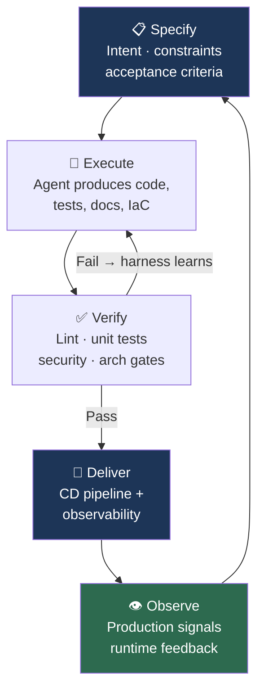
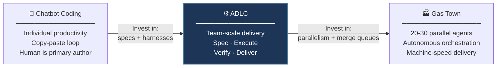

*Agents don't know the intent of what is being created nor can define the quality of the outcome. Humans do. But humans need to enable agents to create disciplined software.*

---

## The Discipline That Prepared Us for This Moment

Back in grad school, Software Engineering was one of my favorite courses. It is still taught as a complete graduate program at my alma mater, and for good reason. It taught me the discipline between coding for fun and a rigorous, process-driven approach to releasing software. Think of a manufacturing plant or an assembly line: inputs are defined, quality is measured at every stage, and the final product ships because the *system* works, not because any single person stayed up all night. A well-oiled software engineering organization runs like clockwork: release managers and program managers deciding what goes into a release and what gets cut, bugs ruthlessly scrubbed daily as release dates approach. I have seen my share of that clockwork, and I have never stopped appreciating it.

Software Engineering, as the name suggests, is the **engineering optimization** of software: process-driven, disciplined, systematic. And here is what excites me most about the agentic era: the principles that make software engineering a discipline — specification, verification, quality gates, feedback loops, supply chain integrity — are not threatened by AI agents writing code. They are **more important than ever**. The question is not whether engineering discipline still matters. The question is how we evolve that discipline to match the extraordinary speed at which agentic tools are reshaping the SDLC.

That is the conversation I want to have in this post. Not vibe coding. Not weekend prototypes. Those tools will provide a solid start for rapid prototyping and MVPs. But for any company where software is the product, where longevity matters, where teams need to collaborate and maintain what they ship: **how do we make agentic software development sustainable, team-based, and enterprise-grade?**

At a recent meetup with software engineering leaders, the energy around this question was palpable. SDLC loops driven by agentic AI will become commonplace, and the smartest leaders in the room were already asking the right follow-up: *What are the strong business cases? How do we organize teams around this? Where does more code actually create more value, and where does discipline create more value?* These are exactly the right questions, and they are engineering questions, not hype questions.

Everyone has a vantage point shaped by where they sit. Mine comes from [nearly two decades](https://sriaradhyula.github.io/) across the full stack of software delivery: real-time media and embedded systems engineering, building test automation frameworks and CI/CD pipelines from scratch, full-stack cloud engineering across AWS, Azure, and GCP, leading globally distributed SRE and platform engineering teams, architecting Kubernetes-native and cloud-native security platforms, and now designing AI-native agentic software platforms. I have worn the hats of technical product owner, SRE team lead, platform architect, CTO of a healthcare SaaS startup, and open-source maintainer. I have had the privilege of interacting with business leaders shaping strategy and engineers shipping under pressure.

What follows are my postulates: opinionated, informed by experience, grounded in what I am seeing across the industry, about where Software Engineering, Platform Engineering, and the SDLC are heading. I am leaning in on this shift, not because the technology is impressive (though it is), but because I believe the discipline of software engineering has prepared us for exactly this moment.

---

## Postulate 1: This Is a Paradigm Shift, and That Is a Good Thing

Every paradigm shift in software gets initially dismissed as incremental. Containers were "just better VMs." Kubernetes was "just another orchestrator." CI/CD was "just scripted deployments."

Agentic AI in software development is not automation. It is a **paradigm shift** in what it means to engineer software. And the opportunity it presents is enormous.

In every previous evolution — Waterfall to Agile, monoliths to microservices, on-prem to cloud — the human remained the primary author of the artifact. The tools changed. The process changed. The feedback loops tightened. But a human wrote the code, a human reviewed the code, and a human decided what shipped.

In the agentic era, that assumption is being tested. Consider the early experiments that hint at what is coming:

[OpenAI's Harness Engineering team](https://openai.com/index/harness-engineering/) ran an internal experiment where three engineers built a production application with over a million lines of code, with zero manually written code, by driving Codex agents through pull requests and CI workflows. They averaged 3.5 PRs per engineer per day over five months. It is early, and the approach has clear limitations, but their takeaway is worth sitting with: the engineer's primary job shifted from writing code to designing environments, specifying intent, and building feedback loops.

[Anthropic's agent teams experiment](https://www.anthropic.com/engineering/building-c-compiler) explored what happens when you give 16 parallel Claude instances a single goal: build a C compiler from scratch. Over nearly 2,000 sessions and $20,000 in API costs, the agents produced a 100,000-line Rust compiler that can build the Linux kernel on x86, ARM, and RISC-V. The researcher's takeaway was not about the compiler itself. It was about what he learned designing harnesses for long-running autonomous agents: how to write tests that keep agents on track, how to structure parallel work, and where the approach hits its ceiling. These are unsolved problems, but the fact that they are now *tractable* problems is the shift.

[Stripe's Minions](https://www.infoq.com/news/2026/03/stripe-autonomous-coding-agents/) offer perhaps the most production-hardened example. Their autonomous coding agents now produce over 1,300 merged pull requests per week, supporting code that processes over $1 trillion in annual payment volume. A developer posts a task in Slack; the agent writes the code, passes CI, and opens a PR. All code is human-reviewed but contains no human-written code. Stripe's core design pattern is what they call "blueprints": orchestration flows that alternate between fixed, deterministic code nodes and open-ended agent loops. As one analysis [noted](https://www.anup.io/stripes-coding-agents-the-walls-matter-more-than-the-model/), the system runs the model, not the other way around.

[GitHub's Squad project](https://github.blog/ai-and-ml/github-copilot/how-squad-runs-coordinated-ai-agents-inside-your-repository/) is exploring repository-native orchestration: specialist agents you "hire" inside your repo that coordinate in parallel, loading shared team decisions and project history from committed files. It is early-stage and evolving, but the direction is clear.

None of these are solved problems. Every team running agents at scale is still learning, still iterating, still discovering failure modes. But they all share a common thread: **the human's value shifted from writing code to designing the system that makes agent-written code reliable.**

As [Bloomberg reported](https://www.bloomberg.com/news/articles/2026-02-26/ai-coding-agents-like-claude-code-are-fueling-a-productivity-panic-in-tech), AI coding agents have fueled what some are calling "the great productivity panic of 2026." But the concluding insight from that coverage deserves emphasis: in this future of disposable code, the biggest productivity hack may be having the restraint to know what not to build at all. That is an engineering insight, not a coding insight.

---

## Postulate 2: Agents Don't Know the Intent or the Outcome. Humans Do.

This is the most important postulate in this entire piece, and it is the one I want every engineering leader to internalize.

AI agents are extraordinarily capable code generators. But they do not know **why** you are building something. They do not understand the business outcome you are optimizing for. They do not know whether the feature you are asking them to build is the right feature, or whether it will create regulatory exposure, or whether it conflicts with a strategic decision made in last quarter's planning cycle.

**Humans own intent. Humans own outcomes. Agents own implementation.**

This framing is liberating, not limiting. It means the engineering discipline shifts upstream, to the work that has always been the hardest and most valuable part of software engineering: understanding the problem deeply, defining what success looks like, specifying constraints clearly enough that machines can operate within them, and verifying that the output meets the standard.

[Spec-Driven Development (SDD)](https://agentfactory.panaversity.org/docs/General-Agents-Foundations/spec-driven-development) is the emerging methodology that codifies this. Rather than treating AI coding agents as sophisticated autocomplete tools, SDD establishes specifications as the primary artifact of software development, with code becoming a generated output derived from human-authored specifications. [GitHub's spec-kit](https://github.com/github/spec-kit) (72,000+ stars) provides the tooling: a four-phase workflow of specify, plan, tasks, and implement that supports over 22 AI agent platforms. I wrote about how we adopted spec-kit in practice — the `.specify/` directory, constitution files, and slash commands — in [Spec-Kit: Scaffolding Projects with AI Coding Assistants](https://sriaradhyula.github.io/posts/spec-kit-scaffolding-with-ai-coding-assistants/). In the open-source communities I contribute to, including [CNOE's ai-platform-engineering](https://github.com/cnoe-io/ai-platform-engineering), we have adopted spec-driven patterns as the default way to coordinate agent work across platform engineering tasks.

[StrongDM's Attractor](https://factory.strongdm.ai/products/attractor) takes this further. It is a non-interactive coding agent designed for use in a [Software Factory](https://factory.strongdm.ai/). Instead of publishing a product, they published an [NLSpec (Natural Language Spec)](https://github.com/strongdm/attractor) for how to build your own. Attractor pipelines are directed graphs defined in Graphviz DOT syntax, where nodes are tasks, edges are transitions, and the execution engine traverses them deterministically until convergence or termination conditions are met. As [Ethan Mollick observed](https://www.oneusefulthing.org/p/the-shape-of-the-thing), the particular details of StrongDM's Software Factory matter less than the fact that such radical experimentation into how we work is now not only possible, but likely necessary.

The implication for engineering leaders: **your most important investment is not in better agents. It is in better specifications, better acceptance criteria, better architectural decision records, and better feedback loops.**

---

## Postulate 3: Stop Panicking. Start Thinking About Where Humans Add Value.

The Bloomberg article on the [productivity panic](https://www.bloomberg.com/news/articles/2026-02-26/ai-coding-agents-like-claude-code-are-fueling-a-productivity-panic-in-tech) captured a real anxiety. But panic is unproductive. The right response is to ask clearly: **where do humans contribute irreplaceable value?**

The answer is in the loops that surround code generation:

**Create and work on agentic loops.** Design the specify-execute-verify-deliver cycle that agents operate within. Structure the work so that each loop produces a verifiable output. Build the harnesses, the CLAUDE.md and AGENTS.md files, the architectural constraints, the CI gates, that keep agents productive and on track.

**Tests and formal verification.** When code is generated at machine speed, your test suite is your immune system. Unit tests, integration tests, property-based tests, mutation testing, static analysis, security scanning: these are not overhead. They are the quality signal that closes the loop. Every failed test is a feedback signal that makes the next agent run better.

**Unambiguate the requirements.** Ambiguity is the enemy of agent productivity. If a human engineer can misinterpret a requirement, an agent will too — but faster and at scale. The discipline of writing clear, testable, unambiguous requirements — always valuable — becomes essential when the consumer of those requirements is a machine.

**Architectural trade-offs and non-functional requirements.** Database migrations, schema changes, backward compatibility, data integrity, latency budgets, cost modeling: these are the "boring" decisions that keep production systems alive. Agents do not have the judgment to make these trade-offs. Humans do.

**Threat modeling and security posture.** On the basic tenets of threat modeling, understanding attack vectors, identifying trust boundaries, mapping data flows: the agentic era demands that these be applied not just to the software being built, but to the development process itself. Your build pipeline, your agent configuration, your MCP server connections are all part of your threat surface now.

The [Shopify directive](https://www.cnbc.com/2025/04/07/shopify-ceo-prove-ai-cant-do-jobs-before-asking-for-more-headcount.html) crystallizes the organizational shift. CEO Tobi Lutke's 2025 memo required teams to demonstrate why AI cannot handle a job before requesting new headcount. But the deeper insight is what Shopify [learned operationally](https://www.firstround.com/ai/shopify): the fastest-growing groups using AI tools at Shopify are not engineering. They are support and revenue teams. The role of the developer is shifting from "code writer" to "system architect" and "quality assurer," and that shift is an elevation of the craft, not a diminishment.

---

## Postulate 4: The SDLC Is Evolving Again, Into the Agentic Development Lifecycle

The evolution is well documented:

1. **Waterfall**: Sequential, predictable, brittle. Worked when requirements were stable and change was expensive.
2. **Agile**: Iterative, adaptive, human-centric. Worked when the bottleneck was feedback loops between humans.
3. **DevOps**: Continuous delivery, infrastructure as code, shift-left testing. Worked when the bottleneck was the wall between dev and ops.
4. **Platform Engineering**: Golden paths, self-service infrastructure, internal developer platforms. Worked when the bottleneck was cognitive load and toil imposed on application teams by platform complexity.

```mermaid
flowchart LR
    W["📋 Waterfall<br/>Plan-driven<br/>sequential"]
    AG["🔄 Agile<br/>Iterative<br/>human-centric"]
    DV["🚀 DevOps<br/>Continuous delivery<br/>shift-left"]
    PE["🛤️ Platform Eng<br/>Golden paths<br/>self-service"]
    CB["💬 Chatbot &<br/>Coding Agents<br/>AI-assisted<br/>individual"]
    AU["🤖 Autonomous<br/>Coding Agents<br/>Spec-driven<br/>team-scale"]
    GT["🏭 Gas Town<br/>Parallel multi-agent<br/>full autonomy"]
    AD["⚙️ ADLC<br/>Harness-guided<br/>ship loops"]

    W --> AG --> DV --> PE --> CB --> AU --> GT --> AD

    style W fill:#495057,color:#fff
    style AG fill:#1864ab,color:#fff
    style DV fill:#0c8599,color:#fff
    style PE fill:#2f9e44,color:#fff
    style CB fill:#6741d9,color:#fff
    style AU fill:#3b5bdb,color:#fff
    style GT fill:#e8590c,color:#fff
    style AD fill:#1d3557,color:#fff,stroke:#ffd60a,stroke-width:3px
```

Each transition from left to right shortened the feedback loop between intent and working software. The first four stages kept the human as the primary author of every artifact. The right half flips that assumption. Most teams in 2026 are somewhere between Chatbot/Coding Agents and Autonomous Coding Agents — the ADLC is the disciplined methodology that governs how you operate anywhere in that right half, and Gas Town represents what the far right of the spectrum looks like in practice today.

Agentic development does not just shorten the loop further. It introduces an **inner loop** where agents iterate autonomously within the guardrails set by humans.

I am calling this the **Agentic Development Lifecycle (ADLC)**. Its defining characteristics:

**[Spec-Driven Development](https://github.com/github/spec-kit) replaces task-driven development.** The primary artifact shifts from code to specifications. The insight is that specs are not a return to Waterfall, because when the cost of regenerating code from an updated spec drops to nearly zero, the economics change completely. You can iterate on specifications at the speed of thought rather than the speed of typing.

**The human becomes the architect, not the bricklayer.** The word "Engineering" means making trade-offs and design choices. In the ADLC, the engineer's output is intent, constraints, and verification — not implementation. As one practitioner [put it](https://embracingenigmas.substack.com/p/exploring-gas-town): "The limiting factor is how quickly you can feed ideas and specifications into the system."

**Ship loops become the heartbeat.** Taking a leaf from MLOps and LLM fine-tuning: think of software as a continuous loop that needs to be trained and validated until the desired outcomes are achieved or the maximum allowable budget is reached. Each iteration through the specify-execute-verify-deliver cycle refines the output. The agent is not a one-shot generator; it is a participant in a convergence loop.

---

## Postulate 5: There Is a Spectrum — From Chatbot Coding to Gas Town. Know Where You Are.

One of the most useful framings I have encountered is thinking of agentic software development not as a binary state — either you have AI or you don't — but as a **spectrum of maturity**.

At one end: **chatbot-based agentic coding**. A developer opens a chat interface, pastes code, asks for changes, copies the result back. Useful for individual productivity. Genuinely helpful. But not a paradigm shift — the human is still the primary author, and the feedback loop still runs through the developer's fingers.

At the other end: **[Gas Town](https://steve-yegge.medium.com/welcome-to-gas-town-4f25ee16dd04)**. A multi-agent orchestrator coordinating 20 to 30 autonomous Claude Code instances in parallel, with a merge queue that batches requests, runs verification gates, and merges to main using a bisecting queue. Code at machine speed, around the clock. The Kubernetes analogy is apt: both systems coordinate unreliable workers toward persistent goals, separating control logic from ephemeral execution. This is a genuine paradigm shift in what it means to produce software.

**The Agentic Development Lifecycle occupies the critical middle of that spectrum** — the zone where teams have moved beyond single-session productivity tools but have not yet built the infrastructure for fully autonomous multi-agent orchestration. It is characterized by:

- **Human-authored specifications** as the primary engineering artifact
- **Single or small-scale agent sessions** executing against those specs, within defined harnesses
- **CI-gated verification** closing the loop on every agent run
- **Human review** of agent-produced PRs before merge

Moving along the spectrum is not inevitable — it is a deliberate engineering and organizational investment:

| Stage | What You Build | What Unlocks Next |
|---|---|---|
| Chatbot Coding | Better prompts, context hygiene | Structured specs and harnesses |
| **ADLC** | **Specs, harnesses, CI gates, human review** | **Parallel agent infrastructure** |
| Gas Town | Merge queues, worktree orchestration, autonomous verification | Fully autonomous ship loops |

The important insight: **you do not need to reach Gas Town to capture enormous value.** The ADLC — specify, execute, verify, deliver — is already a step change in team-scale productivity. Gas Town is the horizon. The ADLC is the immediate opportunity for most organizations in 2026.

This framing also clarifies where to invest. Optimizing for individual developer productivity (chatbot end)? Invest in better prompts and context. Optimizing for team-scale agentic delivery (ADLC)? Invest in specifications, harnesses, and CI gates. Building toward autonomous multi-agent orchestration (Gas Town end)? Invest in parallelism infrastructure, merge queues, and human-in-the-loop escalation paths.

**Know where you are on the spectrum. Invest accordingly. And be honest about the gap between where you are and where the marketing says you are.**

---

## Postulate 6: Quality Trumps Speed

Nobody wants a crappy, subpar, insecure product. For large enterprises, there is reputation harm in shipping inferior products. Imagine a highly active ecommerce platform processing millions of transactions daily, or a banking institution where a single bug could expose customer financial data, or a critical piece of infrastructure software that millions of users depend on. How can future agentic software be shipped responsibly for systems like these?

The answer is: **tight validation and observability loops.**

[Stripe's Minions architecture](https://stripe.dev/blog/minions-stripes-one-shot-end-to-end-coding-agents-part-2) is instructive. Their code manages over $1 trillion in annual payment volume. Every Minion runs in a sandboxed VM with no production access. They use a three-tier feedback loop: local linters in under 5 seconds, selective CI running only relevant tests, and a pragmatic cap of two retry attempts before flagging a human. The design thesis: "putting LLMs into contained boxes compounds into system-wide reliability."

[Anthropic's C compiler experiment](https://www.anthropic.com/engineering/building-c-compiler) demonstrated the same principle. Tests were the harness. The agent team's ability to make sustained progress without human oversight depended entirely on the quality of the test suite guiding them. When tests were clear and incremental, agents converged. When tests were vague, agents drifted.

Quality gates become the product. When agents can produce code at machine speed, your CI pipeline, your linters, your structural tests, your security scans are not overhead. They are what separates working software from expensive technical debt generated at unprecedented velocity.

---

## Postulate 7: Harness Engineering Is How Humans Guide Agents Without Becoming the Bottleneck

The critical question is not "should humans review agent output?" Of course they should. The question is: **how do we design systems where humans guide agents efficiently, so that humans are not roadblocks but are effectively steering agents toward disciplined software?**

The answer is [Harness Engineering](https://openai.com/index/harness-engineering/), the emerging discipline of designing constraints, feedback loops, documentation, and verification systems that channel agent capability toward reliable output.

The term was popularized by Mitchell Hashimoto and formalized by OpenAI's experiments: "anytime you find an agent makes a mistake, you take the time to engineer a solution such that the agent never makes that mistake again." [Martin Fowler's analysis at Thoughtworks](https://martinfowler.com/articles/exploring-gen-ai/harness-engineering.html) identifies three categories: context engineering (curated knowledge bases), architectural constraints (enforced by linters and structural tests), and entropy management (agents that periodically clean cruft and fix documentation drift).

The key insight: a good harness makes agents **more capable**, not just more controlled. [LangChain's coding agent improved from 52.8% to 66.5% on Terminal Bench 2.0](https://www.ignorance.ai/p/the-emerging-harness-engineering), jumping from Top 30 to Top 5, by changing nothing about the model. They only changed the harness. Same model. Different harness. Dramatically better results.

For platform engineering teams, this is a direct extension of the golden path concept. Today's service templates and scaffolding become tomorrow's harnesses — with custom linters, structural tests, context documentation, and feedback loops baked in. The platform team's job shifts from "build the CI pipeline" to "build the system that makes agents produce reliable software at scale."

---

## Postulate 8: Platform Engineering and Test Automation Play a Pivotal Role in Creating Light Ship Loops

Ship loops — the continuous cycle from specification through agent execution, verification, and delivery — are where platform engineering and test automation become the backbone of agentic development.

The architecture that makes ship loops work treats the entire path from intent to production as a single feedback system, with platform engineering providing the rails and test automation providing the signals.

Here is what makes this moment particularly interesting for platform engineering: **in the agentic era, custom software is cheap.** Historically, enterprise CI/CD pipelines have always been custom. Each organization layers its own compliance gates, internal registry integrations, JIRA connectors, deployment approval workflows, and cost-control hooks on top of whatever OSS toolchain it uses. That customization has been expensive — it required dedicated platform engineers to write and maintain the glue. When agents can generate that glue at negligible marginal cost, the calculus changes: ship loops can be *deeply* customized to an enterprise's unique constraints, compliance requirements, and tooling ecosystem using a mix of open-source, proprietary, and purpose-built components. The platform team's job is no longer primarily "pick a supported tool and wrangle it." It is **designing and specifying the ship loop itself**, then letting agents build and maintain the connective tissue.

Ship loops have four phases:

**Specify**: Humans define intent, constraints, acceptance criteria, and non-functional requirements. This is where architectural trade-offs live. For enterprises, this includes compliance requirements, SLA commitments, and regulatory guardrails that agents must respect.

**Execute**: Agents produce implementation artifacts: code, tests, documentation, infrastructure-as-code, database migrations. Multiple agents may work in parallel, using git worktrees or isolated branches to avoid conflicts. The mix of OSS frameworks, proprietary APIs, and custom tooling is specified in the harness — agents navigate it, humans designed it.

**Verify**: Mechanical and AI-driven verification. Linting, type checking, unit tests, integration tests, security scanning, architectural constraint validation, LLM-based code review. Every failure feeds back into the harness so the mistake never recurs. Enterprise-specific gates — SBOM generation, license scanning, SOC 2 evidence collection — are first-class citizens here, not afterthoughts.

**Deliver**: Automated deployment through established CD pipelines, with observability instrumentation baked in. Runtime signals feed back into the specification phase, creating an observability-driven development loop where production behavior informs the next iteration. Custom approval workflows, change management integrations, and deployment windows are encoded as harness constraints, not human checkpoints.

Steve Yegge's [Gas Town](https://steve-yegge.medium.com/welcome-to-gas-town-4f25ee16dd04) project illustrates the frontier: a multi-agent orchestrator coordinating 20 to 30 Claude Code instances in parallel, with a merge queue that batches requests, runs verification gates, and merges to main using a bisecting queue. The [Kubernetes analogy is apt](https://cloudnativenow.com/features/gas-town-what-kubernetes-for-ai-coding-agents-actually-looks-like/): both systems coordinate unreliable workers toward persistent goals, separating control logic from ephemeral execution.

[Bassim Eledath's "8 Levels of Agentic Engineering"](https://www.bassimeledath.com/blog/levels-of-agentic-engineering) framework captures the progression teams are experiencing, from tab-complete autocomplete through context engineering, compounding engineering, MCP and skills integration, harness engineering, background agents, and ultimately autonomous agent teams. Most teams are between levels 3 and 5. The jump to levels 6 through 8 is a phase transition that requires rethinking team structure, not just tooling. And the [12 Factor Agents](https://github.com/humanlayer/12-factor-agents) methodology, modeled on Heroku's classic 12 Factor App, codifies the engineering principles that make this scaling work: own your prompts, own your context window, own your control flow.

---

## Postulate 9: Security Is Not Optional. It Is Paramount.

The agentic era introduces attack surfaces that most organizations are not prepared for. To understand why, start with a framing that every enterprise engineer already knows: **blackboxes**.

### Agents Create Blackboxes. Enterprises Already Know How to Handle Them — Mostly.

When an agent writes a module, a service, or a library, the engineer reviewing the PR may understand what it does at a high level — inputs, outputs, the happy path — but the internal logic is often a blackbox in the same sense that a third-party npm package or a Maven dependency is a blackbox. You did not write it. You did not fully audit it. You are trusting it.

The blackbox can be small: an agent-generated utility function, a generated component library, an integration adapter. Or it can be large: an entire service, a generated data pipeline, a full subsystem. The scale varies. The trust problem is the same.

This is not new. Enterprises have been consuming blackboxes for decades. Every Node.js project has thousands of transitive dependencies. Every Java service pulls in hundreds of Maven artifacts. The OSS ecosystem is built on the shared assumption that widely-used, community-reviewed packages are safe enough to depend on. An entire industry — dependency scanning, SBOM generation, license auditing, vulnerability management, software composition analysis — grew up to manage that risk. That industry is mature, well-tooled, and hard-won.

Recent supply chain incidents are a reminder of what the cost of complacency looks like. Log4Shell exposed the fragility of deeply nested transitive dependencies hiding inside trusted frameworks. The XZ Utils backdoor demonstrated that a patient attacker could compromise a widely-trusted open-source project through social engineering over years. Dozens of npm typosquatting and dependency confusion attacks have shown that the attack surface of the package ecosystem is vast and actively exploited. [IBM's X-Force](https://newsroom.ibm.com/2026-02-25-ibm-2026-x-force-threat-index-ai-driven-attacks-are-escalating-as-basic-security-gaps-leave-enterprises-exposed) reported a nearly 4x increase in large supply chain compromises since 2020, with AI-powered coding tools accelerating the trend.

**Agents introduce a new tier of blackbox risk that sits above the OSS layer.** Unlike OSS packages, agent-generated code:

- Has no community review history or CVE database tracking its known vulnerabilities
- Has no maintainer to issue patches when a flaw is discovered
- Was produced by a model that may have been influenced by training data containing known-vulnerable patterns
- May introduce *new* OSS dependencies — including typosquatted packages, outdated packages with CVEs, or license-incompatible libraries — without flagging any of it unless the harness requires it

And unlike a single npm package, an agent session may generate hundreds of modules across a codebase — each one a potential vector.

### Disciplined Platform Engineering Extends Supply Chain Security to Agent-Generated Artifacts

The tooling already exists. The discipline is applying it consistently:

**Agent provenance and SBOM.** Every agent-generated component should carry provenance metadata: which model generated it, with what harness version, against what spec, at what commit. This is agent SBOM, and it is the foundation of auditability. Without it, you cannot answer the question "which of our modules were produced by an agent session that used a compromised context file?" — and that question will eventually be asked.

**Signing and verification.** Apply [Sigstore](https://www.sigstore.dev/) and [SLSA](https://slsa.dev/) provenance attestations to agent-generated artifacts the same way you would to build artifacts. An agent-produced library that cannot be traced to a verified harness run should not reach production.

**Policy enforcement at CI.** OPA, Cedar, or OpenFGA policies that govern what agent-generated code is allowed to do — which APIs it can call, which data it can access, which external dependencies it can introduce — enforced at CI time, not at runtime. [Coding agents widen the supply chain attack surface](https://securityboulevard.com/2026/03/coding-agents-widen-your-supply-chain-attack-surface/) through prompt injection, toolchain poisoning, and hallucinated dependencies; policy gates are the mechanical check that the harness cannot skip.

**Dependency hygiene for agent-introduced packages.** Every dependency an agent introduces as part of its output should pass through the same ingestion process as any other third-party dependency: SCA scan, license check, known-CVE review. Do not let agents bypass the vetting process that applies to every other package in your dependency tree.

**Periodic re-audit.** Unlike human-written code where a PR review is a one-time event, agent-generated code should be subject to periodic re-audit as the threat landscape evolves. A module generated six months ago by an agent unaware of a newly-discovered vulnerability class is a liability. Treat it like an OSS dependency: track it, scan it, patch it.

The parallel to OSS supply chain security is the most useful mental model for engineering leaders. Enterprises learned — through Log4Shell, through XZ Utils, through painful incidents that made the headlines — to treat their dependency trees as part of their security posture. The same discipline, extended to agent-generated artifacts, is what makes agentic software production-safe at enterprise scale.

### The Broader Agentic Attack Surface

Beyond the supply chain, the [OWASP Top 10 for Agentic Applications 2026](https://www.practical-devsecops.com/owasp-top-10-agentic-applications/) identifies additional risks that are being exploited now: Agent Goal Hijack, Tool Misuse, Identity and Privilege Abuse, and Memory Poisoning. [Cisco's State of AI Security 2026](https://blogs.cisco.com/ai/cisco-state-of-ai-security-2026-report) found only 29% of organizations prepared to secure their agentic deployments.

**Agents operate with broader system permissions than humans typically do.** An agent with terminal access and stored credentials is not the same risk profile as a chatbot in a browser tab.

**Threat modeling must become a first-class engineering artifact.** The [MAESTRO framework](https://cloudsecurityalliance.org/blog/2025/02/06/agentic-ai-threat-modeling-framework-maestro) from the Cloud Security Alliance provides a structured, layer-by-layer approach to the full threat surface.

Security-aware software engineering means enforcing least-privilege for every agent session, treating agent configuration as code, building human-in-the-loop checkpoints for actions with financial or security impact, and monitoring agent behavior for anomalies the same way you monitor production services.

Security cannot be bolted on after agents are in production. It must be designed into the harness from day one.

---

## Postulate 10: Roles Are Normalizing, and New Disciplines Are Emerging

The traditional sharp role boundaries — frontend engineer, backend engineer, DevOps engineer, QA engineer — made sense when the primary constraint was specialized knowledge needed to produce artifacts in each domain. When agents can produce artifacts across domains, the boundaries blur. This is not a threat. It is a **normalization** that unlocks a different kind of specialization.

New competencies are emerging that every engineer needs: harness engineering (designing constraints and feedback loops), context engineering (curating the information environment agents operate within), and specification writing (expressing intent with the precision of a requirements document but the iterability of a conversation).

**Team topology is shifting too.** The [Team Topologies](https://teamtopologies.com/) model — stream-aligned teams, platform teams, enabling teams, complicated subsystem teams — remains the right lens, but what each team *does* is changing. Stream-aligned teams are shifting from "write features" to "specify features and review agent-produced implementations." Platform teams are shifting from "build golden paths" to "build harnesses that make agents walk the golden path automatically." Enabling teams are shifting from "coach on practices" to "coach on specification quality and harness design."

The platform team restructuring is the most concrete near-term change. In a pre-agentic world, a platform team maintained the scaffolding, the service templates, the CI pipeline, and coached application teams on how to use them. In an agentic world, that same team designs and maintains the harnesses — the CLAUDE.md constitutions, the architectural constraint linters, the structural test suites — that channel every agent session toward compliant, reliable output. The golden path does not disappear; it gets encoded into the harness so that agents cannot deviate from it even if prompted to.

Concretely, new specializations are emerging:

- **Harness Engineer**: Designs and maintains the constraint systems, linters, and feedback loops that shape agent behavior. The CI/CD engineer of the agentic era.
- **Specification Author**: Translates business requirements into unambiguous, testable specs that agents can act on. Part product manager, part systems analyst, part technical writer.
- **Agent Reviewer**: Reviews agent-produced PRs with an eye toward correctness, security, and architectural fit — not line-by-line reading, but pattern recognition and acceptance criteria validation.

The [Shopify experience](https://www.firstround.com/ai/shopify) is instructive. They are scaling their intern program dramatically because interns are AI centaurs: they use tools natively, have a beginner's mindset, and push the entire team forward. Shopify's CTO is on the internal leaderboard for highest Cursor token spend. The message is clear: this is not about replacing engineers. It is about elevating what engineering means.

---

## Postulate 11: Buy vs Build vs Generate — The New Decision Framework

For decades, engineering leaders have operated with a two-option decision framework: **buy** (SaaS or licensed software) or **build** (write it yourself). The agentic era adds a third option that changes the calculus entirely: **generate**.

When the marginal cost of producing custom software approaches zero — when an agent can produce a working, tested integration in hours rather than weeks — many decisions that used to be "buy because building is too expensive" become "generate because it fits our constraints exactly."

The decision logic looks like this:

**Buy** when the vendor provides regulatory compliance, security certification, network effects, or data access you cannot replicate. Payroll processing, identity providers, payment rails: the value is not the code, it is the ecosystem and the liability transfer.

**Build** when the logic is core differentiation. Proprietary algorithms, unique data pipelines, competitive moats: this is the code that makes your product *yours*. Agents can assist, but humans define the intent.

**Generate** when the requirement is real but the code is commodity: internal tooling, CI/CD glue, API adapters, migration scripts, one-off data transforms, compliance report generators, internal dashboards. Historically, these fell into a gray zone — too specific to buy, too expensive to build properly. In the agentic era, they belong in the generate column.

The implication for engineering strategy: **the "build vs buy" conversation needs to add a third column in every make-or-buy analysis.** Teams that are still evaluating every internal tool as a buy/build binary are leaving enormous value on the table. And teams that are generating everything without discrimination are generating technical debt at machine speed.

The skill is knowing which column a requirement belongs in — and that judgment is irreducibly human.

---

## Postulate 12: Anti-Patterns — What Bad Agentic Engineering Looks Like

Every paradigm shift generates its own failure modes. The agentic era is no exception. The organizations that struggle will not struggle because they adopted agents too early. They will struggle because they adopted agents without the discipline to use them well.

**Vibe-architecting.** The most common failure mode: applying the vibe-coding instinct to specifications. "Build me a microservices architecture" is not a spec. It is a suggestion. Agents given vague specifications produce code that is confidently structured and subtly wrong — it compiles, it passes shallow tests, and it fails in production in ways that take weeks to trace. Specification quality is the upstream determinant of agent output quality. Garbage in, garbage out — just faster.

**Context rot.** CLAUDE.md files, AGENTS.md files, and harness documentation drift from reality. An agent operating on a context file that describes last year's architecture will produce last year's patterns, confidently, at machine speed. Context files are not set-and-forget; they are living documentation that requires the same disciplined maintenance as any other engineering artifact. Build entropy management — periodic automated reviews of context files against actual code — into your harness from day one.

**Harness debt.** Every agent mistake that is fixed by hand, rather than fixed in the harness, is harness debt. The debt is invisible until it compounds: the same class of mistake recurs across dozens of PRs, each fixed by a human reviewer, none of the fixes feeding back into the system. The OpenAI Harness Engineering principle is worth restating here: *anytime you find an agent makes a mistake, you take the time to engineer a solution such that the agent never makes that mistake again.* This is not overhead. It is the core engineering investment that makes agents more capable over time.

**The 90% trap.** Agents reach 90% completion quickly. The last 10% — edge cases, cross-system integration points, non-functional requirements, security considerations — requires human judgment. The trap is shipping the 90% as if it were 100%, either because the deadline was real or because the agent expressed no uncertainty. Acceptance criteria must be explicit enough that the gap between "agent thinks it is done" and "it is actually done" is verifiable by a machine, not just a human reader.

**Specification inflation.** The overcorrection to vibe-architecting: specs so exhaustive that they specify the implementation rather than the intent. A 10,000-word spec that describes every function signature is not a specification — it is code written in prose. The signal is when agents start asking clarifying questions about the spec rather than the problem. Good specs describe *what* and *why* with enough constraint on *how* to prevent architectural drift, and no more.

---

## Where We Go From Here

**Budget-based development will replace story-point estimation.** When agents generate code, the cost unit shifts from developer-hours to compute-hours plus human-review-hours. Estimation becomes a function of specification complexity and harness quality, not team velocity. The practical shape of this: a "spec complexity budget" that estimates how many agent iterations a feature is likely to require based on the clarity and completeness of the spec, the maturity of the relevant harness, and the integration surface area involved. Teams with mature harnesses and high-quality specs will converge in fewer loops at lower compute cost. Teams with immature harnesses or vague specs will burn budget on rework. The budget is the accountability mechanism that makes specification quality a measurable engineering output — not a soft skill.

**Ship loops and deploy feedback loops will be everywhere.** Every agentic development workflow will converge on some version of this pattern: specify, execute, verify, deliver, observe, repeat. The open-source communities working on this, including projects like [CNOE's ai-platform-engineering](https://github.com/cnoe-io/ai-platform-engineering), are already building the shared infrastructure to make these loops the default mode of operation.

**"Coding is dead" is wrong. "Coding as the primary output of engineering" is evolving.** Engineers will still write code: harness code, constraint code, verification code, glue code. But the bulk of application logic will be generated. The engineering value shifts upstream (specification, architecture, trade-offs) and downstream (verification, observability, security).

**Think of the [Software Factory](https://factory.strongdm.ai/) as the destination.** Not rows of agents churning out code. A carefully designed system of specifications, constraints, feedback loops, and quality gates — with agents as the execution layer and humans as the architects, auditors, and decision-makers.

---

## A Final Thought

I started my career developing real-time media algorithms for Cisco Telepresence, where every millisecond of audio/video latency was budgeted and every RTP packet mattered. I built test automation frameworks before "shift-left" was a phrase anyone used. I architected cloud infrastructure across AWS, Azure, and GCP, led SRE teams across four countries, and built a HIPAA-compliant healthcare platform as a startup CTO. Through all of it, the constant was the same: the systems that shipped reliably were the ones where the engineering discipline was strongest, not where the code was cleverest.

This shift is different. Not because the technology is more impressive, though it is. But because it challenges the fundamental identity of what it means to be a software engineer. For two decades, our value was inextricably linked to our ability to write code. In the agentic era, our value shifts to our ability to **think clearly about systems**, to **specify intent precisely**, to **design constraints that channel power toward purpose**, and to **verify that the output meets the standard**.

That is not a diminishment of the craft. It is an elevation of it.

The vibe coders will build prototypes. The software engineers will build products. The difference, as it has always been, is discipline.

---

*[Sri Aradhyula](https://sriaradhyula.github.io/) is an AI Agentic Platform Engineering Architect at Cisco Outshift, a contributor to open-source agentic AI projects including CNOE and AGNTCY, and chair of the Agentic AI SIG within the CNOE community. Views are his own.*

---

### References

- [Harness Engineering: Leveraging Codex in an Agent-First World](https://openai.com/index/harness-engineering/) (OpenAI, 2026)
- [Building a C Compiler with a Team of Parallel Claudes](https://www.anthropic.com/engineering/building-c-compiler) (Anthropic, 2026)
- [How Squad Runs Coordinated AI Agents Inside Your Repository](https://github.blog/ai-and-ml/github-copilot/how-squad-runs-coordinated-ai-agents-inside-your-repository/) (GitHub, 2026)
- [Stripe Engineers Deploy Minions, Autonomous Agents Producing Thousands of Pull Requests Weekly](https://www.infoq.com/news/2026/03/stripe-autonomous-coding-agents/) (InfoQ, 2026)
- [The Shape of the Thing](https://www.oneusefulthing.org/p/the-shape-of-the-thing) (Ethan Mollick, 2026)
- [AI Coding Agents Are Fueling a Productivity Panic in Tech](https://www.bloomberg.com/news/articles/2026-02-26/ai-coding-agents-like-claude-code-are-fueling-a-productivity-panic-in-tech) (Bloomberg, 2026)
- [The 8 Levels of Agentic Engineering](https://www.bassimeledath.com/blog/levels-of-agentic-engineering) (Bassim Eledath, 2026)
- [Welcome to Gas Town](https://steve-yegge.medium.com/welcome-to-gas-town-4f25ee16dd04) (Steve Yegge, 2026)
- [12 Factor Agents](https://github.com/humanlayer/12-factor-agents) (HumanLayer/Dex Horthy)
- [StrongDM Attractor NLSpec](https://github.com/strongdm/attractor) and [Software Factory](https://factory.strongdm.ai/)
- [Spec-Driven Development with Claude Code](https://agentfactory.panaversity.org/docs/General-Agents-Foundations/spec-driven-development) (Agent Factory, 2026)
- [GitHub spec-kit](https://github.com/github/spec-kit)
- [The Emerging "Harness Engineering" Playbook](https://www.ignorance.ai/p/the-emerging-harness-engineering) (2026)
- [Harness Engineering (Thoughtworks Analysis)](https://martinfowler.com/articles/exploring-gen-ai/harness-engineering.html) (Birgitta Bockeler, 2026)
- [Shopify CEO AI Memo](https://www.cnbc.com/2025/04/07/shopify-ceo-prove-ai-cant-do-jobs-before-asking-for-more-headcount.html) (CNBC, 2025)
- [From Memo to Movement: Shopify's Cultural Adoption of AI](https://www.firstround.com/ai/shopify) (First Round Review, 2026)
- [OWASP Top 10 for Agentic Applications 2026](https://www.practical-devsecops.com/owasp-top-10-agentic-applications/)
- [State of AI Security 2026](https://blogs.cisco.com/ai/cisco-state-of-ai-security-2026-report) (Cisco)
- [IBM X-Force Threat Intelligence Index 2026](https://newsroom.ibm.com/2026-02-25-ibm-2026-x-force-threat-index-ai-driven-attacks-are-escalating-as-basic-security-gaps-leave-enterprises-exposed)
- [MAESTRO: Agentic AI Threat Modeling Framework](https://cloudsecurityalliance.org/blog/2025/02/06/agentic-ai-threat-modeling-framework-maestro) (Cloud Security Alliance)
- [Coding Agents Widen Your Supply Chain Attack Surface](https://securityboulevard.com/2026/03/coding-agents-widen-your-supply-chain-attack-surface/) (Security Boulevard, 2026)
- [Gas Town: What Kubernetes for AI Coding Agents Actually Looks Like](https://cloudnativenow.com/features/gas-town-what-kubernetes-for-ai-coding-agents-actually-looks-like/) (Cloud Native Now, 2026)
- [CNOE AI Platform Engineering](https://github.com/cnoe-io/ai-platform-engineering)
